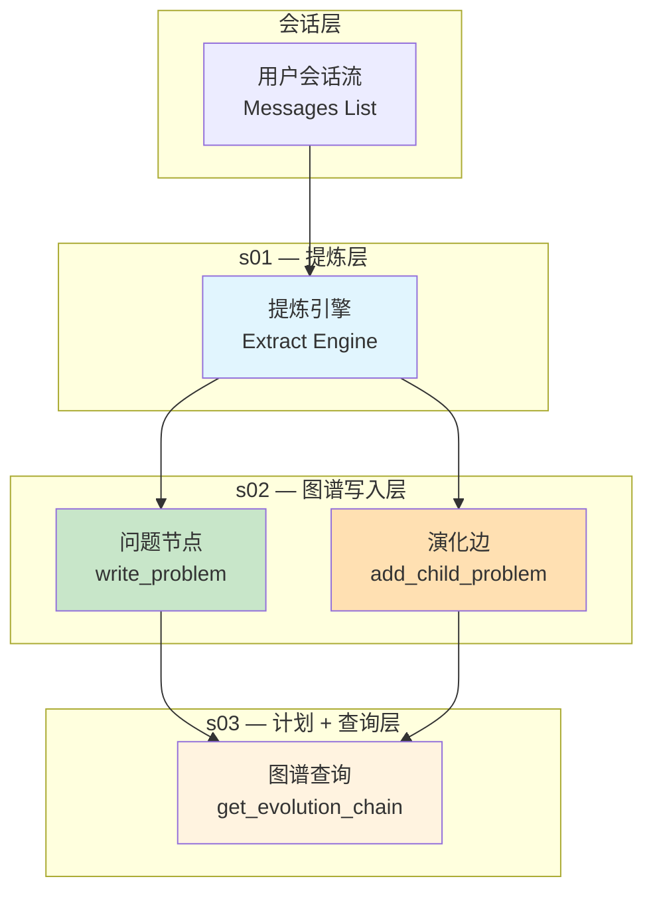
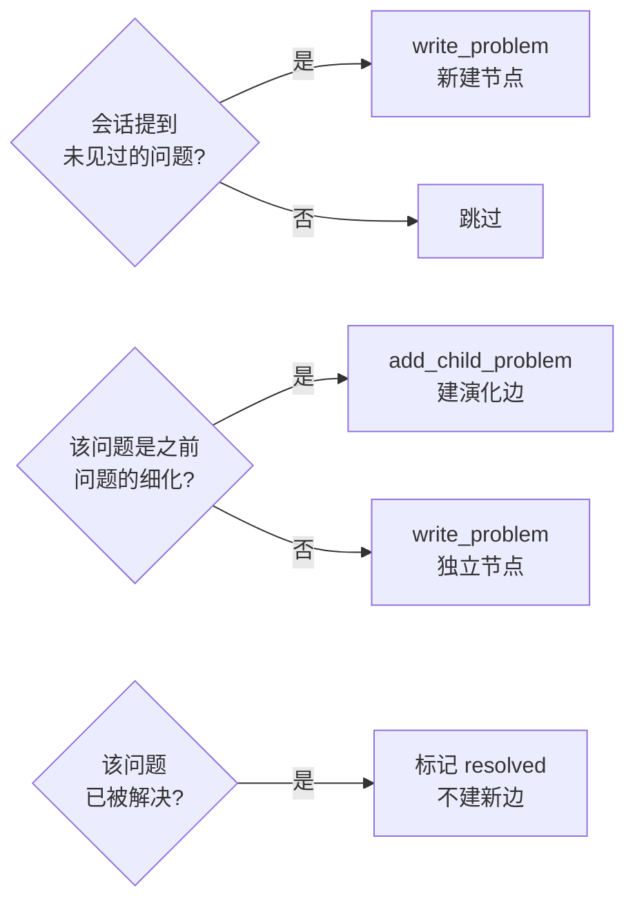

# 从会话提炼图谱 · Session Evolution Graph

**核心观点**：图谱不是手动建的，是从日常会话里「长」出来的。

---

## 整体架构

---

## 三层职责

| 层 | 做什么 | 输入→输出 |
|---|---|---|
| **提炼层（s01）** | 从会话里识别「问题」 | `Messages[]` → `write_problem` |
| **图谱写入层（s02）** | 写入问题节点 + 演化边 | `add_child_problem` → `problem_evolution` |
| **计划+查询层（s03）** | 先计划再查询，返回图谱状态 | `get_evolution_chain` → 链条视图 |

---

## 每章工具一览

| 章节 | 工具名 | 写入表 |
|---|---|---|
| s01 | `write_problem` | `problem_tracking` |
| s02 | `add_child_problem` | `problem_evolution` |
| s03 | `get_problem` | —（读） |
| s03 | `get_evolution_chain` | —（读） |
| s03 | `get_all_problems` | —（读） |

---

## 数据库两张表

### problem_tracking — 问题节点表

| 字段 | 含义 |
|---|---|
| `id` | 节点唯一标识 |
| `problem_title` | 问题简称 |
| `stage` | 当前阶段：`explore` / `expand` / `resolve` |
| `status` | 状态：`open` / `resolved` |
| `first_observed_at` | 首次发现时间 |
| `derived_from` | 父问题 ID（可选） |

### problem_evolution — 演化关系表

| 字段 | 含义 |
|---|---|
| `parent_problem_id` | 父问题 |
| `child_problem_id` | 子问题 |
| `evolution_type` | `derived`（细化）/ `solved`（解决） |
| `description` | 关系描述 |

---

## 提炼引擎的内部判断逻辑

---

## Motto

> **「聪明」主要来自模型训练，不是你在 `if/else` 里堆出来的。**
> **工程师主要做的是 Harness（马甲）：工具、权限、上下文、知识加载、任务持久化。**
> **模型是司机，Harness 是车。**
> **图谱不是手动建的，是从会话里「长」出来的。**
